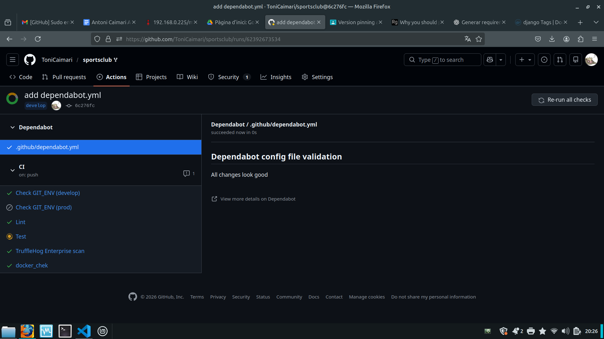
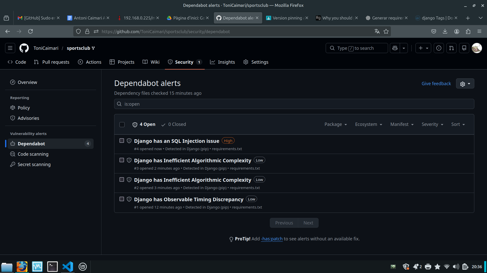

### Github includes a tool to scan for known vulnerabilities in package dependencies, as well as to inform of new versions. Find out about such tool and document the steps required to activate and use it. Execute such steps in your fork of the repository and provide the results. Is there anything that requires change?

La eina en qüestió és **dependabot**. Un bot que s'ha d'habilitar i configurar però que, segons un context que s'ha de donar al seu fitxer dependabot.yml, duu a terme un anàlisi sobre versions, actualitzacions i vulnerabilitats de les dependències del projecte.
Aquestes capacitats van per separat i s'han d'activar específicament.

Per habilitar el dependabot hem d'anar a Security->dependabot i habilitar allò que ens interessi. Un cop habilitat basta amb afegir a la carpeta .github del projecte un fitxer dependabot.yml amb les configuracions adients. En aquest cas he utilitzat la versió més simple i sencilla possible:

```yml
version: 2
updates:
  - package-ecosystem: "pip"
    directory: "/"
    schedule:
      interval: "weekly"
```

En quant el pipeline s'inici, el dependabot llançarà un job propi (no fa falta modificar el ci.yml) oferint resultats:

>com podem veure segons l'anàlisi del dependabot la configuració és correcta.

**PERÒ** si tornam a la secció Security del projecte i entram a la part de dependabot podem veure informes sobre vulnerabilitats:


Com podem veure efectivament és necessaria una revissió de les dependències sobretot per suplir el risc d'SQLInjection que presenta la versió Django del requirements.